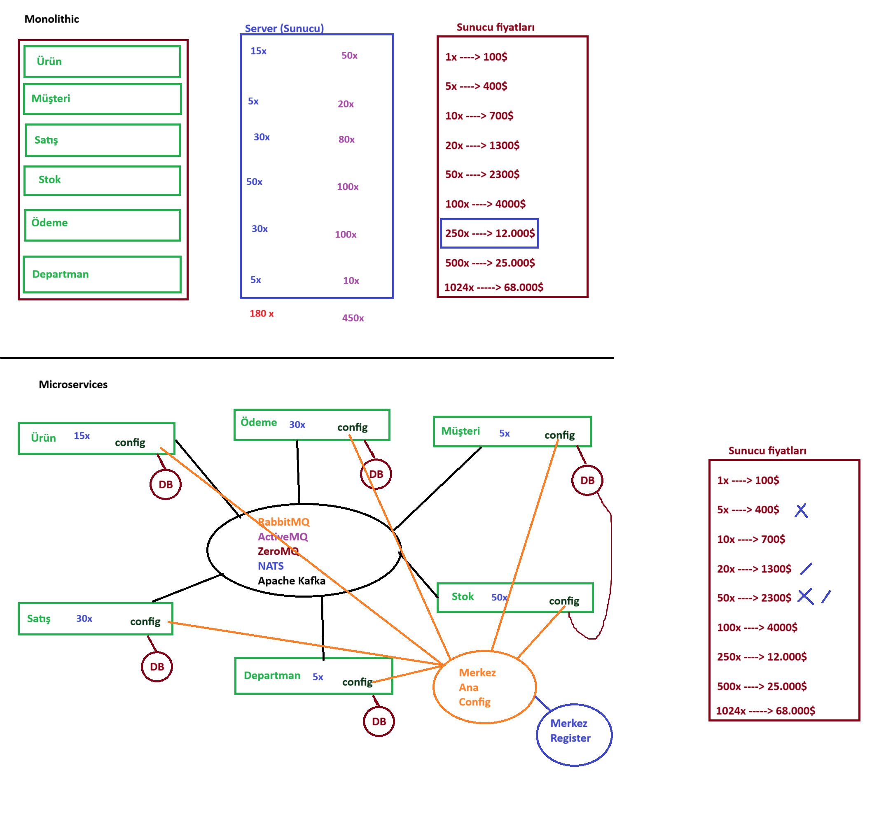
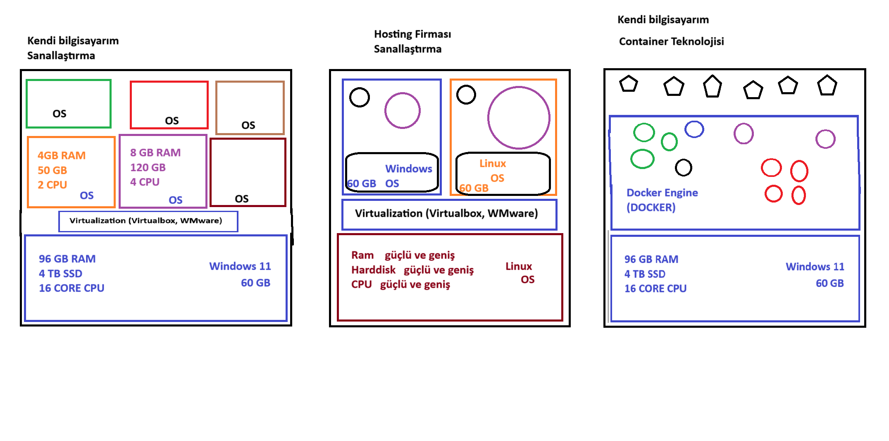

# Java 01 Hello Docker -Microservice






## Description; Example of a simple Java application running in a Docker container
## Technologies; Java, Docker

### Create a example of a dockerfile
```shell
### FROM amazoncorretto:17 // we use amazoncorretto for JDK 
### ARG JAR_FILE=build/libs/java-01-hello-docker-1.0.0.jar // we define jar file path
### COPY ${JAR_FILE} app.jar // we copy jar file to app.jar as a image
### CMD apt-get update && apt-get install -y // use it for terminal commands
### EXPOSE 8080 // we expose 8080 port for run application
### ENTRYPOINT ["java","-jar","/app.jar"] // we define entrypoint for run jar file
``` 

### Build ; we build project using with dockerfile
```shell
### docker build --build-arg JAR_FILE=build/libs/java-01-hello-docker-1.0.0.jar -t DOCKER_USERNAME/java-01-hello-docker:v001 .
```

### Run ; we run project image using with docker run
```shell
###  docker run -p 8080:8080 DOCKER_USERNAME/java-01-hello-docker:v001 .
```

### Push ; we push project image to DockerHub using with docker push
```shell
### docker push DOCKER_USERNAME/java-01-hello-docker:v001
```


### Pull ; we pull project image using with docker pull
```shell
### docker pull DOCKER_USERNAME/java-01-hello-docker:v001
```

### Stop ; we stop project image using with docker stop
```shell
### docker stop DOCKER_USERNAME/java-01-hello-docker:v001
```
